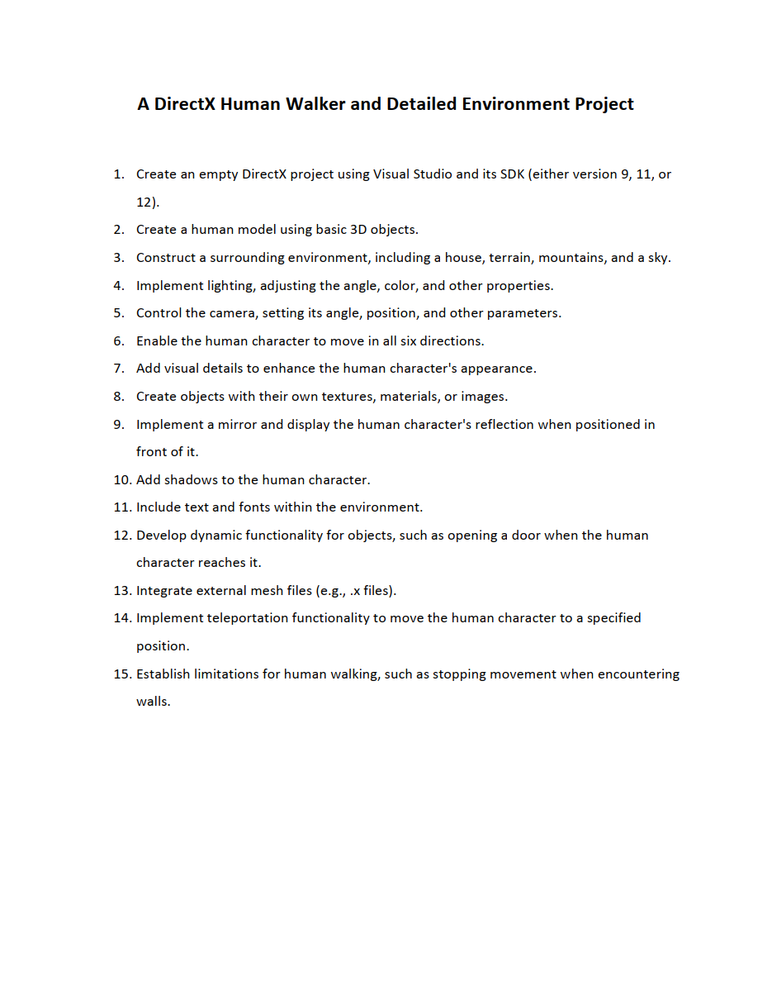

# **🚶🏻 DirectX Human Walker and Detailed Environment Project | پروژه آدمک راه‌رونده و محیط با جزئیات**

**A university project in which a walking human is designed with DirectX 9 and the surrounding environment is also designed.**

**یک پروژه دانشگاهی که در آن یک آدمک راه‌رونده با DirectX 9 طراحی میشود و همچنین محیط پیرامون آن نیز طراحی میگردد.**

# 💬 **نکات پروژه**

* عکس‌های برنامه در دایرکتوری ScreenShots قرار دارند.
* برای اجرا برنامه، به Visual Studio و DirectX SDK 9 نیاز دارید.
* همچنین راهنمای نصب، رفع مشکلات و اجرای برنامه در ریپوزیتوری زیر قرار دارد:

👈🏻 **[کتاب ترجمه‌شده مقدمه‌ای بر برنامه‌نویسی بازی‌های 3D با DirectX 12](https://github.com/bestmahdi2/IntroductionTo3DGameProgrammingWithDirectX12/releases/download/v1.1.0/main.pdf)**
  
* پروژه اصلی در دایرکتوری AliBadiee قرار دارد. پروژه‌ی دیگر محتوای یکسانی دارد ولی با روش دیگری پیاده‌سازی شده‌است و ظاهر متفاوتی نیز دارد.
* همچنین خروجی‌های هر دو پروژه در قسمت release قرار دارند (فایل‌های rar و exe).
* برای دسترسی به همه‌ی پروژه‌های دانشگاهی من، به این لینک مراجعه کنید:

👈🏻 **[پروژه‌های دانشگاهی من](https://github.com/bestmahdi2/Uni__Bachelors_SKU_Path)**

# 📝 **توضیحات پروژه**

# 🖼 **عکس‌های پروژه**

  
  
  
  
  

